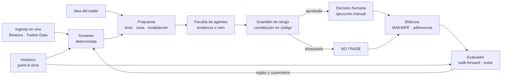
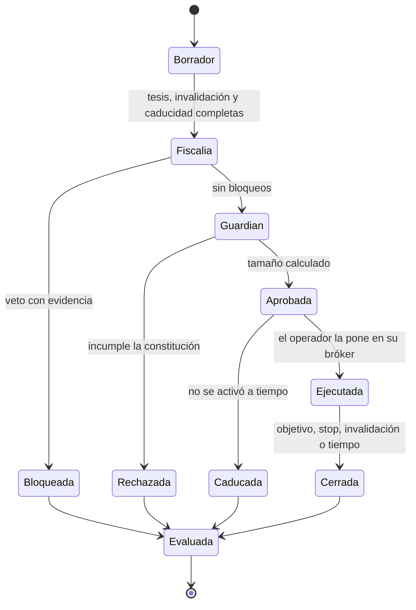

# Visión de TradeMe

> **Propuesta de visión del 16-sep-2026.** Sustituye a la dirección de `backlog.md` y al Plan Maestro
> M0–M10. El equipo la comenta en la [versión compartida](https://claude.ai/code/artifact/fb013e44-831f-4653-9ecf-b957f6963685);
> este fichero es la referencia del repositorio y la que lee el asistente. Las decisiones pendientes
> están al final.

## Veredicto sobre la propuesta

El núcleo de la propuesta de «plataforma integral de asistencia al trader» es correcto y se adopta
entero; la amplitud no. De los 18 frentes que plantea, 12 se adoptan, 2 se aplazan (Forex y
futuros), 2 se descartan (CFDs y arbitraje) y 2 se reformulan (copy trading y sentimiento).

El criterio es uno solo: **cada frente tiene que poder medirse con datos honestos antes de apoyar
una decisión**. Es lo que TradeMe aprendió en seis meses refutando su propio motor.

| Frente | Veredicto | Por qué |
| --- | --- | --- |
| Acciones y ETFs | Adoptar, núcleo de la v1 | Liquidez, datos fundamentales auditables y opciones sobre ellos. Es el universo real del equipo |
| Cripto | Mantener | Ya existe. Queda como laboratorio y spot en 1d; el intradía es negativo tras costes |
| Forex | Aplazar | Mercado OTC: el coste depende del bróker y no hay volumen centralizado. Útil antes como contexto macro que como mercado |
| Spot | Adoptar | Es la base de todo lo demás |
| Opciones | Adoptar, sobre subyacentes líquidos | La prima no depende de acertar la dirección y la varianza por operación es menor: se mide en meses, no en décadas |
| Futuros | Aplazar | Datos de CME de pago, margen y vencimientos. Entran después como micro futuros de cobertura |
| CFDs | Descartar | Contrato contra el propio bróker, con financiación diaria y precio propio: no existe un histórico neutral con el que validar nada |
| Discrecional asistido | Adoptar, núcleo | Es el caso de uso del documento del equipo: juzgar la idea del trader antes de ejecutar |
| Algorítmico / cuantitativo | Adoptar como validador | Las reglas en código se validan con histórico. Su salida es una propuesta, nunca una orden |
| Copy trading | Reformular | Como **auditoría de señales de terceros**, con el mismo evaluador que ya mide las alertas de Reditum. Copiar en automático queda fuera |
| Técnico | Adoptar | Para zonas, invalidación y timing; no para predecir dirección, que ya se midió sin ventaja |
| Fundamental | Adoptar | Auditoría con datos *point-in-time*: cada cifra con la fecha en que se supo |
| Sentimiento | Solo contexto | Miedo/codicia y funding se midieron sin ventaja (6 vectores, 96 pruebas). Sirve para alertar de riesgo, no para votar |
| Especulativo | Adoptar | Swing y rueda de opciones |
| Cobertura | Adoptar | Puts protectoras y collars sobre la cartera: el Guardián de riesgo los necesita |
| Arbitraje | Descartar | Exige ejecución automática y latencia. Con ejecución manual no hay arbitraje posible |
| Datos históricos | Adoptar, con condiciones | Es la palanca más grande. Ver sus límites abajo |
| Núcleo humano | Adoptar íntegro | Premeditación, riesgo determinista, fiscalía con veto y bitácora |

### Tres correcciones a la propuesta

1. **El histórico no elimina la espera; elimina la espera para refutar reglas.** Valida estrategias
   escritas en código. No valida el juicio del comité de agentes ni la disciplina humana, que solo
   se miden hacia delante.
2. **Un agente de IA no se puede evaluar con histórico anterior a su fecha de corte.** El modelo ya
   conoce lo que pasó después: cualquier backtest de sus dictámenes tiene *look-ahead* imposible de
   quitar.
3. **Monte Carlo no añade evidencia.** Reordena las mismas operaciones para estimar la distribución
   del drawdown. Útil para dimensionar el riesgo; inútil para probar que hay ventaja. Y los datos
   tick no hacen falta para operar swing.

## Qué es TradeMe: la constitución

TradeMe es un **juez de propuestas**: recibe una idea de operación, la contrasta con reglas escritas
y evidencia, y devuelve aprobar, observar o bloquear. No predice el mercado, no ejecuta órdenes y no
promete rentabilidad. Su propósito es el del documento del equipo: *que el peor día opere parecido
al mejor día*.

### Los cinco artículos

1. **Sin plan no hay operación.** Cada sesión abre con el checklist premercado. Una propuesta sin
   tesis, invalidación y caducidad no se evalúa.
2. **El riesgo lo calcula código, no un agente.** Tamaño, pérdida máxima, exposición y liquidez son
   funciones deterministas y probadas. Ningún texto de IA las modifica.
3. **Los agentes aportan evidencia o vetan; nunca votan.** Cada dictamen es un JSON con esquema,
   fuentes y bloqueos. No existe una confianza promediada: un bloqueo no se compensa con una
   puntuación alta.
4. **NO TRADE es una salida de primera clase.** Se registra igual que una operación, con su motivo.
5. **Todo queda en la bitácora, y se mide.** Tesis, dictámenes, riesgo, decisión humana, ejecución,
   MAE/MFE, emoción y adherencia. Una regla que no se mide no se puede mejorar.

### Reglas duras de partida

Son las del documento *Agente IA Trading* del equipo. Vivirán en un fichero versionado que el
Guardián hace cumplir; cambiarlas exige PR y revisión.

| Regla | Valor de partida | Qué hace el sistema al alcanzarla |
| --- | --- | --- |
| Riesgo por operación | 1 % del capital | Reduce el tamaño o rechaza |
| Operaciones por día | 3 | Bloquea nuevas propuestas |
| Pérdida diaria máxima | 3 % del capital | Cierra la sesión: no admite más propuestas hasta el día siguiente |
| Horario | 9:00–16:00, hora de mercado | Fuera de horario solo se planifica |
| Promediar perdedoras | Prohibido | Rechaza cualquier propuesta que aumente una posición en pérdida |
| Stop | Obligatorio | Sin invalidación no hay tamaño posible |
| Ejecución real | Siempre manual | `ENABLE_LIVE_TRADING=false`; TradeMe no envía órdenes |

Un bloqueo del Guardián solo lo levanta el operador con un procedimiento explícito que queda
registrado. Ningún agente puede hacerlo.

## Arquitectura modular

Siete módulos con una frontera clara: **lo que decide un número es código determinista; lo que
aporta contexto puede ser un agente**. Todos escriben en la misma base de datos, que ya existe.



Una propuesta entra por el screener o por la idea del trader, pasa por la fiscalía y el Guardián, y
termina siempre en la bitácora, se opere o no.

| Módulo | Responsabilidad | Tipo | Dónde vive |
| --- | --- | --- | --- |
| Datos | Velas, cadenas de opciones, fundamentales y calendario, con fecha de conocimiento | Determinista | `apps/quant` (histórico) y `apps/api` (vivo) |
| Screener | Filtra el universo por precio, volumen, spread, IV y eventos. Devuelve una lista corta | Determinista | `apps/quant`, corrida premercado |
| Propuesta | Contrato único: instrumento, estrategia, tesis, zona, invalidación, caducidad | Esquema JSON | `packages/core-signals` |
| Fiscalía de agentes | Skills del TeamDrive: dictamen con fuentes, objeciones y bloqueos | Agentes con versión de modelo y prompt fijadas | `apps/quant`, servicio |
| Guardián de riesgo | Tamaño, límites diarios, exposición, correlación, liquidez | Determinista, con vectores de paridad | `apps/api`: debe responder aunque `quant` esté caído |
| Bitácora | Ciclo completo de cada propuesta, operada o no | Registro inmutable | TimescaleDB + PWA |
| Evaluador | Desenlaces, walk-forward, nulas, tamaño muestral, auditoría de señales de terceros | Determinista | `apps/quant` |

### Tres decisiones de diseño

1. **Una implementación por módulo.** La paridad Node ≡ Python solo se mantiene donde un número
   decide en vivo: hoy el motor técnico, mañana el Guardián. Lo demás vive solo en Python.
2. **La fiscalía es reproducible o no existe.** Cada dictamen guarda modelo, versión del prompt, hash
   de las entradas y salida completa. Sin eso no se puede evaluar después.
3. **Nada nuevo ejecuta.** El último paso automático es la propuesta aprobada; la orden la pone el
   operador en su bróker y la registra.

## Flujo de una propuesta

Toda propuesta recorre los mismos estados y termina evaluada, se haya operado o no. Eso es lo que
convierte cada día de trabajo —incluidos los días sin operar— en evidencia.



Las bloqueadas, rechazadas y caducadas también se evalúan: su desenlace hipotético es lo que dice si
los vetos protegen o solo estorban.

### Los tres flujos del día (PEDEM)

| Flujo | Cuándo | Qué hace TradeMe | Qué hace el operador |
| --- | --- | --- | --- |
| Premercado — Planear | Antes de la apertura | Calendario de eventos, screener, estado de la cuenta y límites del día | Checklist mental y de contexto; sesgo y niveles del día |
| Intra — Ejecutar y Documentar | Con una idea sobre la mesa | Fiscalía, Guardián y tamaño; registra la decisión al instante | Decide, ejecuta en su bróker, registra el fill y la emoción |
| Postmercado — Evaluar y Mejorar | Al cierre | Desenlaces, MAE/MFE, adherencia al plan | Revisión y **una** lección para el siguiente ciclo |

### El contrato de la propuesta

Un único esquema para todos los activos e instrumentos, versionado en `packages/core-signals` como
hoy la señal:

```json
{
  "propuesta_id": "uuid",
  "origen": "trader | screener | regla | tercero",
  "instrumento": {"clase": "ETF", "simbolo": "QQQ", "tipo": "opcion",
                  "derecho": "put", "strike": 480, "vencimiento": "2026-10-16"},
  "estrategia": "cash_secured_put",
  "objetivo": "especulativo | cobertura",
  "tesis": "texto con el porqué",
  "zona_entrada": [2.10, 2.40],
  "invalidacion": {"subyacente_bajo": 468.0, "condiciones": ["earnings_antes_del_vencimiento"]},
  "salida_planificada": {"objetivo": "recomprar al 50 % de la prima", "tiempo": "21 DTE"},
  "caducidad": "2026-09-18T20:00:00Z",
  "dictamenes": ["id de cada dictamen de la fiscalía"],
  "riesgo": "lo calcula el Guardián, nunca la propuesta"
}
```

**La unidad sigue siendo R, definida antes de operar.** En acciones, 1 R es la distancia a la
invalidación. En spreads de riesgo definido, la pérdida máxima. En una put vendida, lo que costaría
recomprarla al tocar la invalidación: la pérdida teórica máxima (strike por 100) haría que todo
pareciera sin riesgo.

## Pipeline de datos históricos

El histórico permite refutar o sostener una **regla escrita en código** en días, no en años, siempre
que cada dato se lea tal como se conocía en su fecha. La regla que lo sostiene ya existe en TradeMe:
la capa de datos externos guarda `observed_at` (a qué momento se refiere el dato) y `published_at`
(cuándo se supo), y solo se lee con `as_of()`. El pipeline extiende ese contrato a precios, opciones
y fundamentales. Ver `datos-externos.md`.

### Tres capas

1. **Crudo e inmutable.** Cada descarga se guarda tal cual (Parquet), con un manifiesto: fuente,
   rango pedido, fecha de descarga, filas, checksum y licencia. Nunca se reescribe; si la fuente
   corrige, entra una descarga nueva.
2. **Normalizado.** Tablas en TimescaleDB con identificadores estables y unidades explícitas.
3. **Vista *point-in-time*.** La única forma autorizada de leer: `as_of(momento)`, que devuelve lo
   que se sabía en ese instante.

### Modelo de datos

| Tabla | Qué guarda | La trampa que evita |
| --- | --- | --- |
| `instrumentos` | Símbolo, clase, bolsa, moneda, alta y **baja** de cotización | Sesgo de supervivencia: sin las empresas que dejaron de cotizar, cualquier estrategia parece mejor |
| `acciones_corporativas` | Splits, dividendos y cambios de símbolo, con fecha ex y fecha de anuncio | Precios ajustados con información del futuro. Se guarda el precio **sin ajustar** y se ajusta al leer |
| `velas` | OHLCV por intervalo (1d y 1h bastan para swing) | La que ya existe, ampliada a acciones, ETFs y forex |
| `contratos_opcion` | Subyacente, derecho, strike, vencimiento, multiplicador | Contratos ajustados por splits que cambian de multiplicador |
| `cotizaciones_opcion` | Fin de día por contrato: **bid, ask**, volumen, interés abierto, precio del subyacente | Evaluar al último precio operado en vez de al que realmente se podía operar |
| `hechos_fundamentales` | Cifra XBRL, periodo, formulario, **fecha de presentación** y número de registro | Usar una cifra reexpresada antes de que existiera |
| `eventos` | Resultados trimestrales y datos macro, con fecha de anuncio y *vintage* | Evitar un evento que en su momento nadie había anunciado |
| `ingestas` | Cada corrida: fuente, rango, filas, errores, huecos | Una fuente caída que parece una fuente sin novedades |

La volatilidad implícita y las griegas se **calculan en casa** a partir de bid/ask, no se copian del
proveedor: así se pueden reproducir y comparar entre fuentes.

### Reglas de validación sobre histórico

1. **Regla escrita antes de mirar.** Hipótesis, parámetros y criterio de éxito quedan en el código
   antes de correr el estudio, como ya se hizo con el meta-modelo y el Fundamental Score.
2. **Walk-forward con nula por bloques**, los mismos de `evaluacion` y `nula`.
3. **Costes realistas.** En opciones el coste dominante es el spread: se entra y se sale a un precio
   fijado de antemano entre el punto medio y el lado malo.
4. **Cada variante probada se cuenta.** Con muchas pruebas sobre los mismos datos, la mejor gana por
   azar. El listado de intentos alimenta la corrección por pruebas múltiples, al estilo del
   [Deflated Sharpe Ratio](https://www.davidhbailey.com/dhbpapers/deflated-sharpe.pdf) de Bailey y
   López de Prado, que exige número de intentos, asimetría, curtosis y longitud de la muestra.
5. **Una bóveda.** El último tramo del histórico no se toca hasta la validación final de cada regla.
6. **Monte Carlo para el riesgo, no para la ventaja.** Remuestrear por bloques las operaciones de
   una regla da la distribución del drawdown y el riesgo de ruina, que alimentan al Guardián. No
   prueba que la regla gane.

### Lo que el histórico no puede validar

| Qué | Por qué | Cómo se mide entonces |
| --- | --- | --- |
| Dictámenes de agentes LLM | El modelo se entrenó con los años que se quieren probar. [Glasserman y Lin](https://arxiv.org/abs/2309.17322) muestran que el backtest sale sesgado si ambos periodos se solapan, y que conocer la empresa distorsiona el juicio | Solo hacia delante, en papel, midiendo la precisión de los vetos. Los modelos *point-in-time* son una línea de investigación abierta ([Look-Ahead-Bench](https://arxiv.org/abs/2601.13770)), no una solución lista |
| Disciplina del operador | No hay adherencia ni emoción en un CSV | Bitácora hacia delante |
| Ejecución real | Fills parciales y spreads en mercados rápidos | Papel primero; comparar fill contra punto medio |

### Tamaño, orden de magnitud

Una cadena completa de SPY supera los miles de contratos por día. Guardar solo vencimientos de hasta
60 días y deltas entre 0,05 y 0,60 reduce el volumen varias veces sin perder lo que la rueda usa.
Para 10–20 subyacentes y 5 años de fin de día, TimescaleDB con compresión en el portátil es
suficiente; el crudo en Parquet va fuera de la base. Son estimaciones a confirmar con la primera
descarga real.

## Fuentes de datos recomendadas

La primera etapa se puede construir **sin gastar nada**: fundamentales y fechas de resultados de la
SEC, macro de FRED, cripto de Binance y tres años de opciones fin de día de ThetaData Free. Pagar solo
tiene sentido cuando una regla sobreviva a ese histórico y pida más años. Precios comprobados en las
páginas oficiales el 16-sep-2026.

| Necesidad | Fuente | Qué da | Coste | Límite a tener en cuenta |
| --- | --- | --- | --- | --- |
| Fundamentales EE. UU. | [SEC EDGAR companyfacts](https://www.sec.gov/search-filings/edgar-application-programming-interfaces) | Cada cifra XBRL con `filed` (fecha de presentación), `accn`, formulario y periodo. Fuente primaria | Gratis, sin clave | Solo presentaciones con XBRL; hay que normalizar conceptos. Una cifra reaparece en informes posteriores: la primera `filed` es cuando se supo |
| Fechas de resultados | [SEC EDGAR submissions](https://www.sec.gov/search-filings/edgar-application-programming-interfaces) | Cada 8-K con sus ítems y hora de aceptación; el ítem 2.02 son resultados. Comprobado con Apple: 30-jul-2026, 20:30 UTC, tras el cierre | Gratis, sin clave | No trae la fecha anunciada de antemano, solo la de publicación |
| Macro con *vintages* | [FRED/ALFRED](https://fred.stlouisfed.org/docs/api/fred/realtime_period.html) | Cada serie tal como se conocía en una fecha pasada (`realtime_start`, `realtime_end`) | Gratis, clave gratuita | Ya integrado en la capa de datos externos |
| Opciones fin de día, arranque | [ThetaData](https://docs.thetadata.us/Articles/Getting-Started/Subscriptions.html) Free | Opciones y acciones fin de día desde el 1-jun-2023 | Gratis | Unos tres años: suficiente para montar el pipeline, poco para validar |
| Opciones, más historia | [ThetaData](https://www.thetadata.net/pricing) Value / Standard | Value: 1 minuto con quotes e interés abierto desde 2020. Standard: tick con IV desde 2016 | 40 y 80 USD/mes | Standard y Pro son tick: más de lo que necesita el swing |
| Opciones, historia larga | [ORATS](https://orats.com/near-eod-data) near-EOD | 2007 a hoy, más de 5.000 símbolos, NBBO bid/ask, IV y griegas, tomado 14 minutos antes del cierre | 599 USD pago único + 99 USD/mes | Unos 500 GB. Su IV está suavizada: se recalcula en casa desde bid/ask |
| Opciones y acciones, un proveedor | [Massive](https://massive.com/pricing), antes Polygon.io | Opciones: 2 años (29 USD), 4 (79 USD), 5+ con quotes (199 USD). Acciones: 5 años (29 USD), 10 (79 USD), 20+ (199 USD) | 29–199 USD/mes por clase | Menos historia de opciones que ORATS al mismo precio |
| Acciones sin sesgo de supervivencia | [Sharadar](https://sharadar.com/) ([datasets](https://www.quantrocket.com/sharadar/)) | Empresas activas y deslistadas desde los 90, *point-in-time*; precios desde 1998, 8-K desde 1993, S&P 500 histórico desde 1957 | Precio no publicado; nivel gratuito solo con las 30 del Dow | Hace falta cuando el universo sea amplio; con 20 ETFs líquidos no |
| Opciones intradía | [Databento](https://databento.com/datasets/OPRA.PILLAR) | OPRA completo, histórico pago por uso | 125 USD de crédito inicial | Solo si algún día se valida algo intradía |
| Cripto | [Binance public data](https://github.com/binance/binance-public-data) | Spot y futuros: velas de 1 s a 1 mes, trades y aggTrades, en zip diarios y mensuales con SHA256 | Gratis, sin clave | Ya usado por TradeMe vía API |

### Lo que no sirve como fuente histórica

- **Interactive Brokers.** Su API no sirve
  [opciones vencidas ni fin de día de opciones](https://interactivebrokers.github.io/tws-api/historical_limitations.html),
  y limita a 60 peticiones cada 10 minutos. Sirve para la cuenta de papel y el vivo, no para validar.
- **Sandbox de tastytrade.** Se
  [reinicia cada 24 horas y no sirve cotizaciones](https://developer.tastytrade.com/docs/sandbox):
  prueba el flujo de órdenes, no la estrategia.
- **Agregadores de fundamentales** para cifras que decidan algo. La propia skill del CFO de Hierro lo
  exige: la cifra de la SEC prevalece.

## Qué se reutiliza de TradeMe 0.76

Casi toda la infraestructura pasa tal cual; lo que cambia es la pregunta que se le hace. Se congela
el motor predictivo como laboratorio, sin borrar nada.

| Pieza actual | Se convierte en | Cambio necesario |
| --- | --- | --- |
| Tabla `snapshots` y su evaluación de desenlaces | Bitácora de propuestas | Generalizar a instrumento y estrategia; añadir decisión humana, fill, emoción y adherencia |
| Capa de datos externos: `observed_at`, `published_at`, `dil.store.as_of()` | Contrato *point-in-time* del histórico | Extender a velas, opciones y fundamentales |
| `evaluacion`, `walkforward` (con embargo), `nula` (bloques), `promocion.decidir` | Evaluador | Ninguno para reglas; nuevas métricas para opciones |
| `alfa.p_falsos_positivos` | Control de pruebas múltiples | Registrar cada variante probada |
| `tamano_muestral` y check 7 | Seguimiento de muestra de cualquier regla | Hipótesis y horizonte por regla, no por clave |
| `costes` (R neta) | Modelo de costes | Añadir spread de opciones y comisión por contrato |
| `plan.ts` y `sizing` | Guardián de riesgo | Límites diarios, exposición y correlación; vectores de paridad |
| `correlaciones`, `independence`, `/exposicion` | Guardián: exposición agregada | De cripto a cartera multiactivo |
| Cuarentena y lista blanca | Gobierno de estrategias | Mismo mecanismo: una regla sin evidencia no opera |
| Proveedores Binance y Twelve Data, `huecos` | Módulo de datos en vivo | Añadir cadenas de opciones y calendario |
| Artefactos con escritura atómica y recarga | Publicación de reglas y listas del screener | Ninguno |
| PWA, alertas, push, login, asistente sobre `docs/` | Interfaz de checklist, propuesta y bitácora | Pantallas nuevas; la base sirve |
| CI con cuatro puertas y `salud-1d.sql` | Igual, más checks de ingesta | Ninguno |

### Qué se congela

- **Ensemble técnico como generador de señal.** Sigue calculándose como contexto (régimen, zonas,
  volatilidad), pero no propone operaciones.
- **Captura de 20 claves cada 15 minutos.** Pasa a una corrida premercado y alertas por evento.
- **Optimizador.** Ya apagado; queda así.
- **Backtest actual.** Es cuadrático en el número de velas: antes de pasarle años de histórico hay
  que linealizarlo o sustituirlo por uno vectorizado.

## Hoja de ruta

Cinco etapas en unos seis meses, con como mucho dos frentes a la vez: interfaz y Guardián en
`apps/api`/`apps/web`, datos y evaluación en `apps/quant`. Cada etapa cierra con un criterio
comprobable, no con una fecha. Las duraciones son estimaciones.

| Etapa | Objetivo | Duración | Criterio de salida |
| --- | --- | --- | --- |
| 0 | Constitución y contratos | 1–2 semanas | Esquemas de propuesta y dictamen versionados; la constitución rechaza en tests sus 7 casos |
| 1 | Motor de propuesta y bitácora | 3–4 semanas | Una semana en papel registrada entera, NO TRADE incluidos |
| 2 | Ingesta histórica | 4–6 semanas, en paralelo con la 1 | Un test reconstruye un día pasado y demuestra que no aparece nada publicado después |
| 3 | Validación de reglas y screener | 4–6 semanas | Veredicto publicado de la primera regla con criterio fijado antes; screener diario reproducible |
| 4 | Fiscalía de agentes y papel hacia delante | 6–8 semanas | Veredicto sobre si los vetos evitan pérdidas mejor que el azar |

### Etapa 0 · Constitución y contratos

- [ ] `constitucion.yaml` con las reglas duras y su validador, con un test por regla
- [ ] `propuesta.schema.json` v1 en `packages/core-signals`, con el contrato de la sección de flujo
- [ ] `dictamen.schema.json` común a las 17 skills: estado, fuentes, objeciones, bloqueos, versión de
      modelo y prompt
- [ ] Universo v1: 10–20 ETFs y acciones líquidas de la lista del equipo, con filtro de volumen y
      spread escrito
- [ ] Pasar la captura de 20 claves cada 15 minutos a una corrida premercado

### Etapa 1 · Motor de propuesta y bitácora

- [ ] Migraciones: `sesiones`, `propuestas`, `dictamenes`, `decisiones`, `ejecuciones`, `diario`
- [ ] Guardián v1 en `apps/api`: tamaño por riesgo, operaciones y pérdida diaria, stop obligatorio,
      no promediar; vectores de paridad
- [ ] PWA: checklist premercado, propuesta, decisión, registro manual del fill y revisión postmercado
      con una lección
- [ ] Evaluador: desenlace de toda propuesta, operada o no, con MAE/MFE, para acciones y ETFs en spot
- [ ] Salud: check de propuestas sin cerrar y sesiones sin revisión

### Etapa 2 · Ingesta histórica

- [ ] Capa cruda en Parquet con manifiesto por descarga
- [ ] Tablas del modelo de datos y `as_of()` para todas
- [ ] Cargadores: EDGAR companyfacts y 8-K 2.02, FRED con vintages, ThetaData Free (opciones fin de
      día desde junio de 2023), velas diarias de acciones y ETFs
- [ ] IV y griegas calculadas en casa desde bid/ask, con modelo versionado
- [ ] Checks de calidad en salud: huecos, duplicados, bid mayor que ask, saltos de precio sin split
- [ ] Linealizar o sustituir el backtest cuadrático

### Etapa 3 · Validación de reglas y screener

- [ ] Primer estudio con la regla escrita antes: rueda sistemática sobre los ETFs del universo,
      delta, días a vencimiento y salida fijados, costes al lado malo del spread
- [ ] Comparación obligatoria contra comprar y mantener el subyacente, con nula por bloques y bóveda
- [ ] Registro de todas las variantes probadas para la corrección por pruebas múltiples
- [ ] Monte Carlo por bloques: drawdown y riesgo de ruina como parámetros del Guardián
- [ ] Screener premercado: liquidez, IV rank calculado, resultados antes del vencimiento; publica la
      lista corta como artefacto
- [ ] Auditoría de señales de terceros: las alertas de Reditum con el mismo evaluador

### Etapa 4 · Fiscalía de agentes y papel hacia delante

- [ ] Orquestador de skills: dictamen validado contra esquema, modelo y prompt fijados, hash de
      entradas guardado
- [ ] Tres skills primero: `macro-news-catalysts`, `fundamental-financial-audit` y
      `devils-advocate-review`
- [ ] Los dictámenes solo anotan o bloquean; el Guardián decide el tamaño
- [ ] Papel hacia delante con ejecución manual y bitácora completa
- [ ] Medir la precisión de los vetos: desenlace de lo bloqueado frente a lo aprobado, contra el azar
- [ ] Coste por dictamen y por propuesta

**Después de la etapa 4, y solo con evidencia:** micro futuros de cobertura, Forex, el resto de las
17 skills y, si algún día, ejecución real detrás de la bandera.

## Fuera de alcance y decisiones pendientes

Seis cosas quedan fuera explícitamente y cinco decisiones bloquean la etapa 0.

### Fuera de alcance

| Qué | Por qué |
| --- | --- |
| Ejecución automática de órdenes | Contradice la constitución y el propio documento del equipo: «un agente que ejecuta es un robot disfrazado» |
| CFDs y arbitraje | Sin histórico neutral los primeros; sin ejecución automática no existe el segundo |
| Copiar operaciones de terceros | Se audita su historial; no se replica |
| Intradía y 0DTE | El coste por operación domina, como ya pasó con 15m en cripto |
| Datos tick | No aportan nada a decisiones de swing y multiplican el almacenamiento |
| Predicción direccional como señal | La ventaja bruta del ensemble es casi cero en todas las temporalidades y 96 pruebas de alfa no la mejoraron; queda como contexto |

### Decisiones para el equipo

- [ ] **Universo v1.** Qué 10–20 subyacentes. Propuesta: los ETFs amplios y sectoriales de la lista
      (VOO, QQQ, XLF, SMH) y las megacaps líquidas (MSFT, NVDA, GOOG, META). Las biotech pequeñas,
      fuera de la v1: liquidez y eventos binarios
- [ ] **Bróker para papel y operación manual.** IBKR, con las seis preguntas del compañero
      pendientes, o tastytrade, confirmando antes con su equipo de cuentas que Colombia es elegible
- [ ] **Números reales de la constitución.** Las reglas de partida son de intradía. La rueda necesita
      además un máximo de capital comprometido como garantía y un máximo por subyacente
- [ ] **Presupuesto de datos.** Arrancar gratis y fijar desde ya qué resultado justifica pagar ORATS
      o ThetaData
- [ ] **Fiscalidad y reglas de cuenta.** Retenciones como no residente y reglas del bróker sobre
      cuentas pequeñas: a confirmar con el bróker y un asesor, no las decide TradeMe

## Fuentes

Páginas abiertas y comprobadas el 16-sep-2026. Los campos de EDGAR se verificaron además descargando
los JSON de Apple (CIK 0000320193).

- [Glasserman y Lin, *Assessing Look-Ahead Bias in Stock Return Predictions Generated By GPT Sentiment Analysis* (arXiv 2309.17322)](https://arxiv.org/abs/2309.17322)
- [Benhenda, *Look-Ahead-Bench* (arXiv 2601.13770)](https://arxiv.org/abs/2601.13770)
- [Bailey y López de Prado, *The Deflated Sharpe Ratio*](https://www.davidhbailey.com/dhbpapers/deflated-sharpe.pdf)
- [SEC, EDGAR Application Programming Interfaces](https://www.sec.gov/search-filings/edgar-application-programming-interfaces)
- [St. Louis Fed, FRED API Real-Time Periods](https://fred.stlouisfed.org/docs/api/fred/realtime_period.html)
- [ThetaData, Subscriptions](https://docs.thetadata.us/Articles/Getting-Started/Subscriptions.html) y [Pricing](https://www.thetadata.net/pricing)
- [ORATS, Historical Options Data — Near End-of-day](https://orats.com/near-eod-data)
- [Massive (antes Polygon.io), Pricing](https://massive.com/pricing)
- [Sharadar](https://sharadar.com/) y [QuantRocket, Sharadar Data](https://www.quantrocket.com/sharadar/)
- [Databento, OPRA dataset](https://databento.com/datasets/OPRA.PILLAR)
- [Binance, binance-public-data](https://github.com/binance/binance-public-data)
- [Interactive Brokers, TWS API Historical Data Limitations](https://interactivebrokers.github.io/tws-api/historical_limitations.html)
- [tastytrade, Sandbox](https://developer.tastytrade.com/docs/sandbox) e [International Accounts](https://tastytrade.com/learn/accounts/account-types/international-account/)
